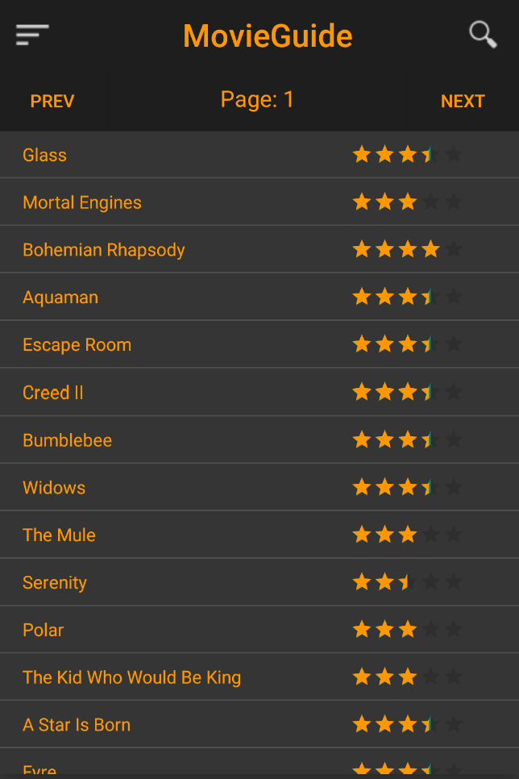
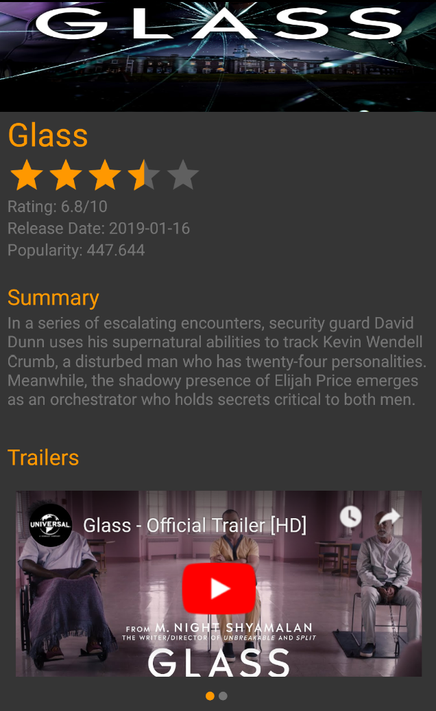
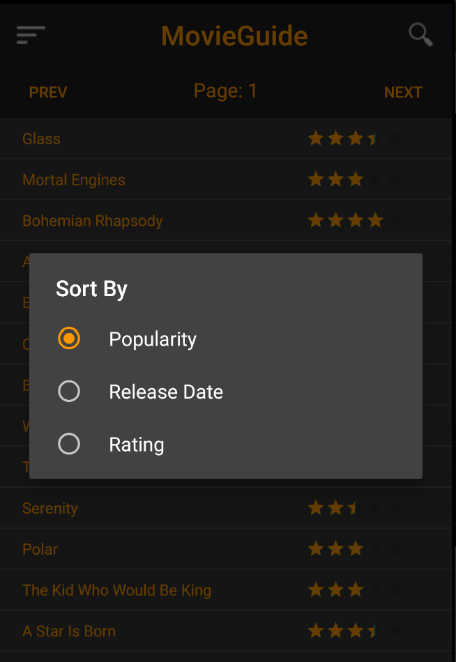
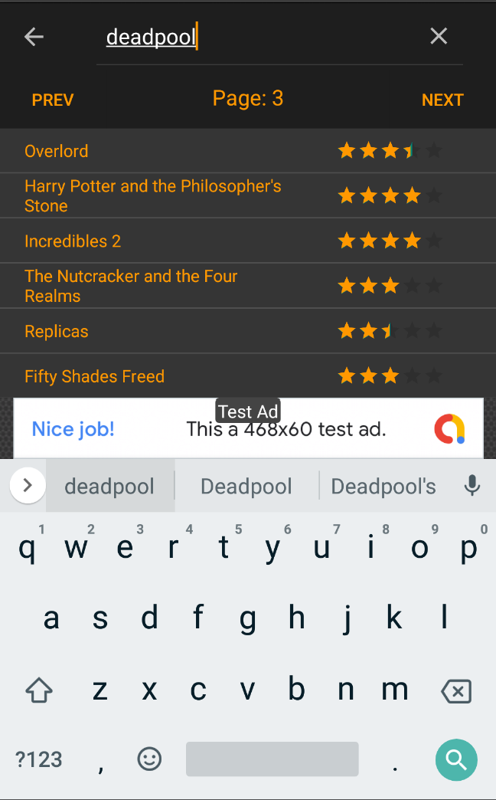

# MovieGuide
This application can be run by downloading and importing the project into Android Studio.

MovieGuide utilizes an up-to-date open source API to pull movie ratings, summaries, and trailers. It includes movies from various different industries around the world. Screenshots of the application can be found below.

 
 
 

 
 

 
 

 
 

